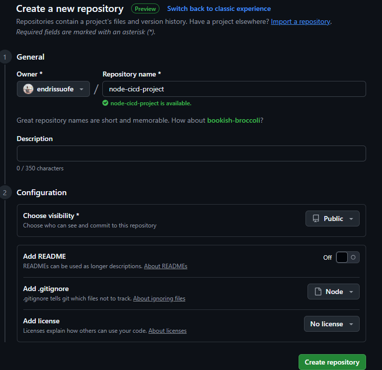

# CI/CD with GitHub Actions: Project Documentation

This README documents the process of setting up a simple Node.js web application and implementing Continuous Integration and Continuous Deployment (CI/CD) using GitHub Actions. The project demonstrates how to automate testing and ensure code quality across multiple Node.js versions.

## Project Overview

The goal of this project was to create a basic Node.js application that serves a static web page and to set up a CI/CD pipeline using GitHub Actions. The pipeline automates testing across multiple Node.js versions and ensures the application is built and deployed consistently.

### Prerequisites

To complete this project, the following were required:
- **Git and GitHub**: Basic knowledge of version control and GitHub repository management.
- **Node.js and npm**: Familiarity with Node.js for building the application and npm for package management.
- **Text Editor/IDE**: Used Visual Studio Code for editing code.
- **Local Development Environment**: Node.js installed locally to run and test the application.
- **Internet Connection**: Required for pushing to GitHub and accessing GitHub Actions.
- **Basic CI/CD Understanding**: Helpful but not mandatory, as the course provided foundational knowledge.

## Step-by-Step Implementation

### 1. Setting Up the GitHub Repository

1. **Created a GitHub Repository**:
   - Navigated to GitHub and created a new repository named `node-cicd-project`.
   - Initialized it with a README and a `.gitignore` file for Node.js.
   - Cloned the repository locally using:
     ```bash
     git clone https://github.com/your-username/node-cicd-project.git
     ```

   **screenshots**:
   


### 2. Creating the Node.js Application

1. **Initialized the Node.js Project**:
   - Navigated to the cloned repository folder:
     ```bash
     cd node-cicd-project
     npm init -y
     ```
   - Installed Express.js for serving the static web page:
     ```bash
     npm install express
     ```

2. **Created the Application Code**:
   - Created an `index.js` file to set up a basic Express server:
     ```javascript
     const express = require('express');
     const app = express();
     const port = 3000;

     app.get('/', (req, res) => {
       res.send('<h1>Welcome to My CI/CD Demo</h1><p>This is a simple static page served by Express.</p>');
     });

     app.listen(port, () => {
       console.log(`Server running at http://localhost:${port}`);
     });
     ```
   - Created a simple test script `test.js` using Mocha for testing:
     ```javascript
     const assert = require('assert');
     describe('Basic Test', () => {
       it('should return true', () => {
         assert.equal(true, true);
       });
     });
     ```
   - Installed Mocha for testing:
     ```bash
     npm install mocha --save-dev
     ```
   - Added a test script to `package.json`:
     ```json
     "scripts": {
       "start": "node index.js",
       "test": "mocha"
     }
     ```

3. **Tested Locally**:
   - Ran the application locally:
     ```bash
     npm start
     ```
   - Opened `http://localhost:3000` in a browser to verify the static page.
   - Ran tests:
     ```bash
     npm test
     ```

   **Evidence**:
   - Screenshot of the running application in the browser saved as `img/local-app-running.png`.
   - Screenshot of the terminal showing successful test results saved as `img/test-results.png`.

### 3. Setting Up GitHub Actions Workflow

1. **Created the Workflow File**:
   - Created a `.github/workflows/ci.yml` file in the repository with the following content:
     ```yaml
     name: CI Pipeline
     on:
       push:
         branches: [ main ]
       pull_request:
         branches: [ main ]
     jobs:
       build:
         runs-on: ubuntu-latest
         strategy:
           matrix:
             node-version: [14.x, 16.x, 18.x]
         steps:
         - uses: actions/checkout@v3
         - name: Use Node.js ${{ matrix.node-version }}
           uses: actions/setup-node@v3
           with:
             node-version: ${{ matrix.node-version }}
         - name: Install Dependencies
           run: npm install
         - name: Run Tests
           run: npm test
     ```
   - This workflow triggers on `push` or `pull_request` events to the `main` branch, tests the application across Node.js versions 14.x, 16.x, and 18.x, and runs the test suite.

2. **Pushed Changes to GitHub**:
   - Committed and pushed the code to the `main` branch:
     ```bash
     git add .
     git commit -m "Initial commit with Node.js app and GitHub Actions workflow"
     git push origin main
     ```

   **Evidence**:
   - Screenshot of the GitHub Actions workflow running successfully saved as `img/workflow-success.png`.

### 4. Verifying CI/CD Pipeline

1. **Checked Workflow Execution**:
   - Navigated to the "Actions" tab in the GitHub repository to verify that the workflow ran successfully for all Node.js versions.
   - Confirmed that tests passed in the workflow logs.

2. **Experimented with Changes**:
   - Made a small change to `index.js` (e.g., updated the HTML content) and pushed it to trigger the workflow again.
   - Verified that the CI pipeline caught any errors (e.g., intentionally broke a test to see the workflow fail).

   **Evidence**:
   - Screenshot of the GitHub Actions workflow logs showing a failed test (if applicable) saved as `img/workflow-failure.png`.
   - Screenshot of the updated webpage after a successful push saved as `img/updated-page.png`.

## Project Structure

```
node-cicd-project/
├── .github/
│   └── workflows/
│       └── ci.yml
├── img/
│   ├── repository-creation.png
│   ├── local-app-running.png
│   ├── test-results.png
│   ├── workflow-success.png
│   ├── workflow-failure.png
│   └── updated-page.png
├── index.js
├── test.js
├── package.json
├── node_modules/
└── README.md
```

## Lessons Learned

- **CI/CD Benefits**: Automating testing with GitHub Actions ensures code quality and consistency across different environments.
- **GitHub Actions**: Learned how to create workflows, define triggers, and use matrix strategies to test across multiple Node.js versions.
- **Practical Application**: Setting up a simple Node.js application and integrating it with a CI pipeline provided hands-on experience with real-world development practices.

## Next Steps

- Add deployment steps to the GitHub Actions workflow (e.g., deploy to a hosting service like Heroku or Vercel).
- Expand the application with additional features and more comprehensive tests.
- Explore advanced GitHub Actions features, such as caching dependencies or using custom actions.

## Evidence Screenshots

All screenshots are stored in the `img/` folder:
- `repository-creation.png`: GitHub repository creation.
- `local-app-running.png`: Application running locally in the browser.
- `test-results.png`: Terminal output of successful tests.
- `workflow-success.png`: GitHub Actions workflow success.
- `workflow-failure.png`: GitHub Actions workflow failure (if applicable).
- `updated-page.png`: Updated webpage after changes.